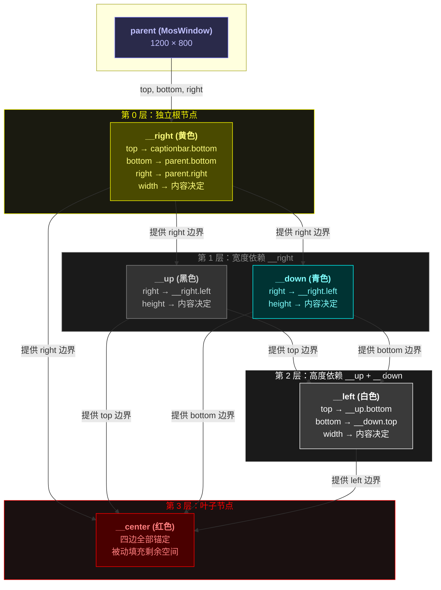

# 层级依赖图（顶层 → 底层）

```mermaid
graph TB
    subgraph ROOT[" "]
        parent["<b>parent (MosWindow)</b><br/>1200 × 800"]
    end

    subgraph L0["第 0 层：独立根节点"]
        __right["<b>__right (黄色)</b><br/>top → captionbar.bottom<br/>bottom → parent.bottom<br/>right → parent.right<br/>width → 内容决定"]
    end

    subgraph L1["第 1 层：宽度依赖 __right"]
        __up["<b>__up (黑色)</b><br/>right → __right.left<br/>height → 内容决定"]
        __down["<b>__down (青色)</b><br/>right → __right.left<br/>height → 内容决定"]
    end

    subgraph L2["第 2 层：高度依赖 __up + __down"]
        __left["<b>__left (白色)</b><br/>top → __up.bottom<br/>bottom → __down.top<br/>width → 内容决定"]
    end

    subgraph L3["第 3 层：叶子节点"]
        __center["<b>__center (红色)</b><br/>四边全部锚定<br/>被动填充剩余空间"]
    end

    parent -->|"top, bottom, right"| __right
    __right -->|"提供 right 边界"| __up
    __right -->|"提供 right 边界"| __down
    __up -->|"提供 top 边界"| __left
    __down -->|"提供 bottom 边界"| __left
    __right -->|"提供 right 边界"| __center
    __up -->|"提供 top 边界"| __center
    __down -->|"提供 bottom 边界"| __center
    __left -->|"提供 left 边界"| __center

    style parent fill:#2a2a4a,stroke:#8080ff,color:#c0c0ff
    style __right fill:#4a4a00,stroke:#ffff00,color:#ffff80
    style __up fill:#333,stroke:#888,color:#ccc
    style __down fill:#003333,stroke:#00ffff,color:#80ffff
    style __left fill:#3a3a3a,stroke:#ffffff,color:#ffffff
    style __center fill:#4a0000,stroke:#ff0000,color:#ff8080

    style L0 fill:#1a1a10,stroke:#ffff00,color:#ffff00
    style L1 fill:#1a1a1a,stroke:#888,color:#888
    style L2 fill:#1a1a1a,stroke:#fff,color:#fff
    style L3 fill:#1a1010,stroke:#f00,color:#f00
```
