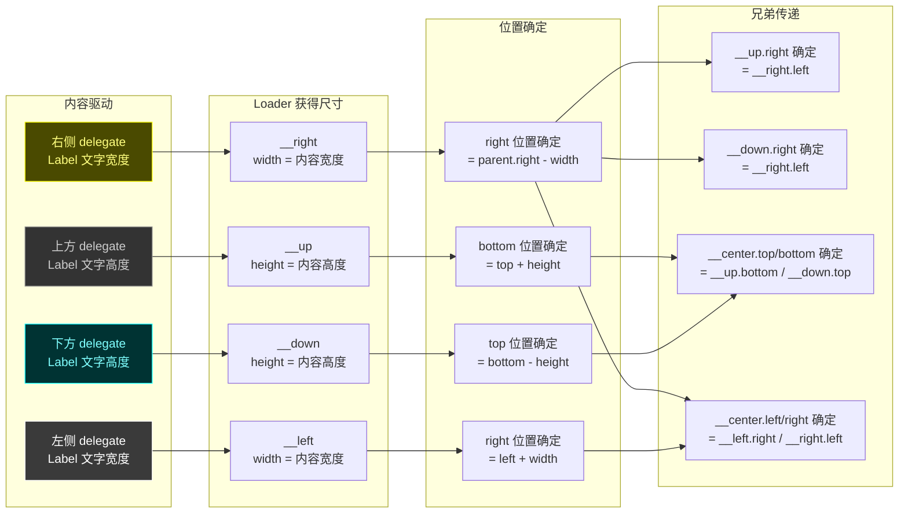

# 尺寸传递链（内容 → 尺寸 → 位置 → 兄弟）

```mermaid
flowchart LR
    subgraph CONTENT["内容驱动"]
        c_right["右侧 delegate<br/>Label 文字宽度"]
        c_up["上方 delegate<br/>Label 文字高度"]
        c_down["下方 delegate<br/>Label 文字高度"]
        c_left["左侧 delegate<br/>Label 文字宽度"]
    end

    subgraph SIZE["Loader 获得尺寸"]
        L_right["__right<br/>width = 内容宽度"]
        L_up["__up<br/>height = 内容高度"]
        L_down["__down<br/>height = 内容高度"]
        L_left["__left<br/>width = 内容宽度"]
    end

    subgraph POSITION["位置确定"]
        P_right["right 位置确定<br/>= parent.right - width"]
        P_up["bottom 位置确定<br/>= top + height"]
        P_down["top 位置确定<br/>= bottom - height"]
        P_left["right 位置确定<br/>= left + width"]
    end

    subgraph BROTHERS["兄弟传递"]
        B_up["__up.right 确定<br/>= __right.left"]
        B_down["__down.right 确定<br/>= __right.left"]
        B_center_tb["__center.top/bottom 确定<br/>= __up.bottom / __down.top"]
        B_center_lr["__center.left/right 确定<br/>= __left.right / __right.left"]
    end

    c_right --> L_right
    c_up --> L_up
    c_down --> L_down
    c_left --> L_left

    L_right --> P_right
    L_up --> P_up
    L_down --> P_down
    L_left --> P_left

    P_right --> B_up
    P_right --> B_down
    P_up --> B_center_tb
    P_down --> B_center_tb
    P_right --> B_center_lr
    P_left --> B_center_lr

    style c_right fill:#4a4a00,stroke:#ffff00,color:#ffff80
    style c_up fill:#333,stroke:#888,color:#ccc
    style c_down fill:#003333,stroke:#00ffff,color:#80ffff
    style c_left fill:#3a3a3a,stroke:#fff,color:#fff
```
