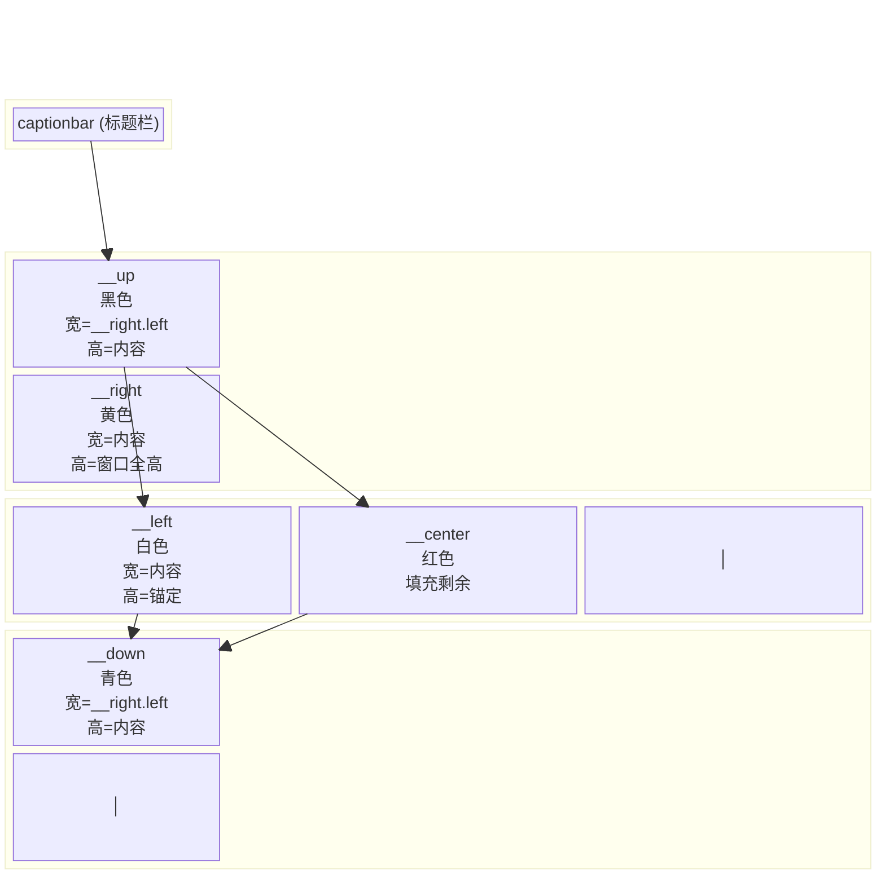

# 窗口布局示意

```mermaid
block-beta
    columns 5

    block:title:1
        columns 1
        titlebar["captionbar (标题栏)"]
    end
    space:4

    block:row1:5
        columns 4
        up["__up<br/>黑色<br/>宽=__right.left<br/>高=内容"]
        space:3
        right1["__right<br/>黄色<br/>宽=内容<br/>高=窗口全高"]
    end

    block:row2:5
        columns 3
        left["__left<br/>白色<br/>宽=内容<br/>高=锚定"]
        center["__center<br/>红色<br/>填充剩余"]
        right2["│"]
    end

    block:row3:5
        columns 4
        down["__down<br/>青色<br/>宽=__right.left<br/>高=内容"]
        space:3
        right3["│"]
    end

    titlebar --> up
    up --> left
    up --> center
    left --> down
    center --> down
```
