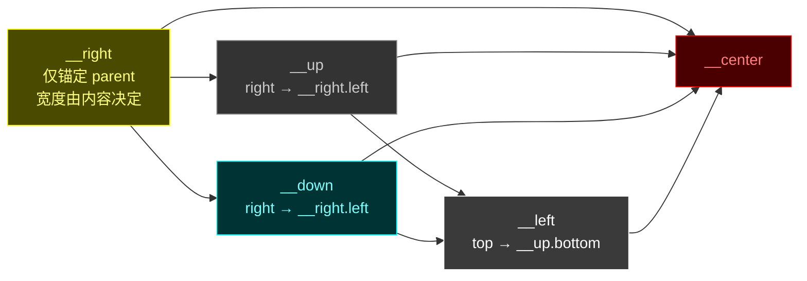

# 循环依赖警示（错误 vs 正确）

## ❌ 错误：双向依赖形成循环

```mermaid
flowchart LR
    A["__up<br/>anchors.right: __right.left"] -->|"需要知道"| B["__right<br/>anchors.left: __up.right"]
    B -->|"需要知道"| A

    style A fill:#4a0000,stroke:#ff0000,color:#ff8080
    style B fill:#4a0000,stroke:#ff0000,color:#ff8080
```

**结果**：QML 锚定系统无法解析，布局崩溃，只剩黄色覆盖全屏。

---

## ✅ 正确：单向依赖无循环

```mermaid
flowchart LR
    R["__right<br/>仅锚定 parent<br/>宽度由内容决定"] --> U["__up<br/>right → __right.left"]
    R --> D["__down<br/>right → __right.left"]
    U --> L["__left<br/>top → __up.bottom"]
    D --> L
    R --> C["__center"]
    U --> C
    D --> C
    L --> C

    style R fill:#4a4a00,stroke:#ffff00,color:#ffff80
    style U fill:#333,stroke:#888,color:#ccc
    style D fill:#003333,stroke:#00ffff,color:#80ffff
    style L fill:#3a3a3a,stroke:#fff,color:#fff
    style C fill:#4a0000,stroke:#ff0000,color:#ff8080
```
